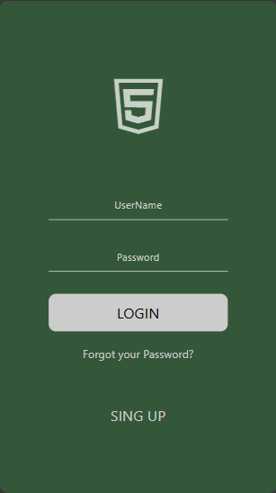
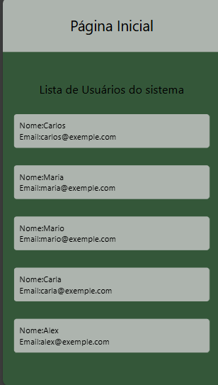

 # Tela de Login Mobile com API e JWT
## Descrição do Projeto

Este projeto consiste em uma tela de login mobile integrada a uma API desenvolvida em Node.js, responsável por validar o usuário e controlar o acesso utilizando JWT (JSON Web Token).

O sistema não utiliza banco de dados. Em vez disso, os usuários são armazenados em um array, que simula uma base de dados para fins de aprendizado e testes.

Após o login bem-sucedido, a API retorna um token JWT e permite o acesso a uma segunda tela, onde é exibida a lista de usuários cadastrados.

## Objetivo

O principal objetivo deste projeto é praticar e consolidar conceitos como:

Autenticação de usuários

Comunicação entre Front-end e Back-end

Uso de JWT para controle de acesso

Consumo de API no front-end

Estruturação de um fluxo de login

## Prints das Telas
### Tela de Login

### Lista de Usuários

## Tecnologias Utilizadas
🔹 Front-end

Interface mobile

Fetch API para comunicação com o back-end

Armazenamento do token JWT para autenticação

🔹 Back-end

Node.js

Express

JWT (JSON Web Token)

Middleware de autenticação

Array simulando banco de dados

## Funcionamento da Autenticação

O usuário informa suas credenciais na tela de login.

O front-end envia os dados para a API.

A API verifica se o usuário existe no array de usuários.

Se os dados estiverem corretos:

Um token JWT é gerado.

O token é retornado ao front-end.

O front-end utiliza o token para acessar uma rota protegida.

A API retorna a lista de usuários cadastrados, que é exibida na segunda tela.

## Aprendizados

Com este projeto foi possível aprender e praticar:

Autenticação com JWT

Middleware no Express

Integração entre front-end mobile e API

Simulação de banco de dados para testes

